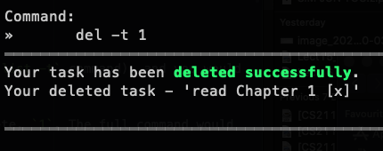
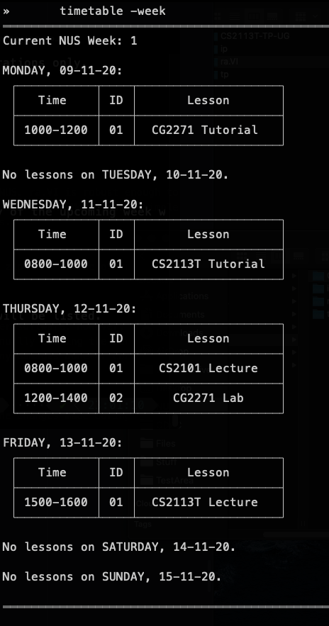
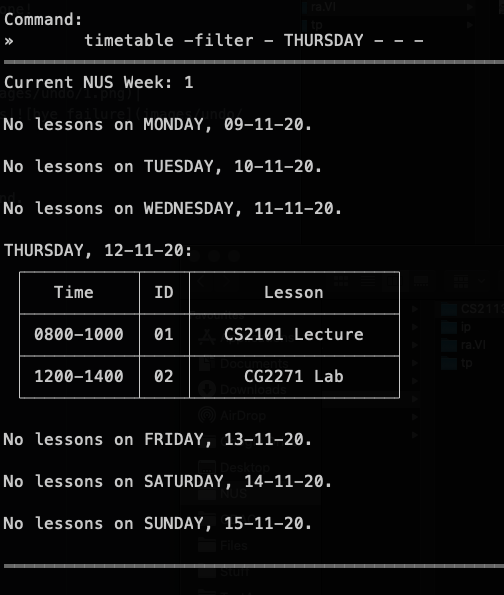

# ra.VI User Guide

Welcome to the ra.VI User Guide! Choose a section from the table of contents on the left, or simply start reading from the introduction. This User Guide will give you step-by-step instructions to start your journey in planning out your NUS life.

---

## Introduction

Repository Assistant with a Versatile Interface (ra.VI) is a desktop app for managing tasks, deadlines, and timetable, optimised for use via a Command Line Interface (CLI). If you can type fast, ra.VI can manage your tasks and timetable faster than traditional GUI apps.

This user guide aims to provide you with a clear documentation of ra.VI's features. In addition, the quick start guide provides an start-to-end setup process to begin tracking your tasks, modules, and lessons with ra.VI!

---

### Product Overview

ra.VI is targeted at you - the NUS freshman. As a freshman, there are many documents and new procedures that you must get familiar with. This may be daunting for you but ra.VI will provide you with the assistance you need.

By helping you keep track of your tasks and deadlines, you will be able to keep on top of deadlines.
Moreover, the timetable feature helps you to schedule your lessons, allowing you to be more prepared for lessons.

Adding on, ra.VI also allows you to keep track of your CAP, so that you can keep tabs on how well you are doing, motivating you towards that elusive CAP 5.0.

---

### How to use this Guide

This user guide will give you a step-by-guide tutorial on how to use each of the commands provided in ra.VI. To aid this, this guide is written with specific formatting to help you understand how to use ra.VI better.

`Grey highlighted font` like this indicate a command or a keyword. For example, `help` or `list -t`.

Keywords like `<day>` and `<lesson_type>` are surrounded by angle brackets ("<" and ">"), and they indicate the positions of extra information you need to provide to the command. For example, `add -m <module_code>` means that you need to fill in the module code you want in the place of the `<module_code>`. It would look something like `add -m CS2113T`.

We also have some special text boxes to help you understand how to use ra.VI!

```tip
This box shows you information that isn't necessary, but will be helpful.
```

```note
This box shows you useful information that you will need to know.
```

```warning
This box tells you about things you need to be alert about. If you're not careful, you might end up with an error!
```

---

### Keywords

#### Command-Line Interface

The Command-Line Interface (or CLI for short) is a type of user interface which lets a user control a computer program like ra.VI. Instead of the Graphical User Interface (GUI) with buttons and menus like you are probably used to, the CLI is entirely text-based. This makes it less intuitive but far faster to use, especially if you are a fast typer!

#### Tasks

A task refers to something that you would like to get done. This refers to reading a book or doing an assignment. Tasks can be created with or without a deadline.

#### Deadline

A deadline refers to a date and time associated with a task. This is in the format: `DAY-MONTH-YEAR TIME_24H`, e.g. `23-12-2020 1400` or `1-2-2000 0800`.

#### Modules

A module refers to a module taken under NUS. Entered modules will be checked against the list of NUS modules taken from [NUSMods](https://nusmods.com/timetable/sem-1).

#### Module Code

A module code refers to the **official** module code of the module you are trying to refer to. As with modules, ra.VI will be taking reference from [NUSMods](https://nusmods.com/timetable/sem-1).

#### CAP

CAP refers to Cumulative Average Point, which is the [grading system used by NUS](http://www.nus.edu.sg/registrar/academic-information-policies/graduate/modular-system). The CAP will be calculated based on your modules and the grades you have assigned to them.

#### Done

Any task can be marked as “done”. This will signify completion of the task so that you can get an easy view of any remaining tasks.

#### Timetable

The timetable holds all the lessons you take. It allows you to manage the lessons for the modules that you are taking.

#### NUS Week Number

NUS’s semesters last for 6 weeks, followed by Recess Week, then another 6 weeks, and finally Reading Week for a total of 14 weeks. When you first use ra.VI, you will be asked to tell ra.VI the current NUS week number. After setting the timetable up the first time, you do not need to go through the set up again.

#### Lesson Type

Some commands have a `lesson_type` field for you to specify a certain type of lesson. Here are the accepted values:\
`TUTORIAL`, `LECTURE`, `SEMINAR`, `LAB`, `RECITATION`, `SESSION`.

```warning
Similar to the `day` field, this format must be followed exactly! It has to be fully spelled out as shown here, and entirely in uppercase.
```

#### Repeat

`repeat` is a field to specify how often lessons should repeat.
* `0` - Does not repeat.
* `1` - Repeats every week.
* `2` - Repeats every **even** week.
* `3` - Repeats every **odd** week.

#### Day

Some commands have a `day` field for you to specify a certain day. Here are the accepted values:\
`MONDAY`, `TUESDAY`, `WEDNESDAY`, `THURSDAY`, `FRIDAY`, `SATURDAY`, `SUNDAY`.

```warning
This format must be followed exactly! Fully spelled out in uppercase. `Monday`, `Mon`, `monday` are examples of what will **not** work. If you want to specify Monday, only `MONDAY` will work.
```

#### Time

Some commands require you to enter a time. The `time` field requires the hours and minutes of the time you want to specify, in the [24H format](https://en.wikipedia.org/wiki/24-hour_clock). For example, 9AM would be `0900` and 2:15PM would be `1415`.

#### Deadline

Some commands require you to enter a date and time for a deadline. The date portion should have the day, month, and year written in numbers and separated with dashes.

For example, 30 December 2020 would be `30-12-2020`. The time portion is the same as described in the [Time](#time) explanation above. A full deadline of “15 February 2021 3:30AM” would be `15-02-2021 0330`.

#### Undo

Some commands edit your tasks, modules, and lessons. All commands that edit your information can be undone! Here’s a list:
* Adding / deleting / editing tasks.
* Completing tasks.
* Adding / deleting / editing modules.
* Adding / deleting / editing lessons to / from the timetable.
* Resetting the timetable.
* Grading a module.

---

### ra.VI’s Interface


ra.VI is a CLI application, which means you control it entirely with text commands. This is the start screen of ra.VI, after you've used it at least once and initialised ra.VI with the current NUS week number. ra.VI shows you the loading statuses of your data in the welcome message. Your data can either be successfully loaded, skipped (if you have no data), or corrupted if something is wrong with the file.

```note
All your data is saved in the `data` folder that will be created when ra.VI first runs! There will be 4 save files:
* `mod_data.json`
* `task_data.json`
* `timetable_data.json`
* `nus_mod_data.json`

If any of these files are corrupted (unreadable by ra.VI), ra.VI will rename them with a ".bak" at the end to indicate that it is no longer in use as a save file. For example, "mod_data.json" would become "mod_data.json.bak".
```


This is what you should first see when you launch ra.VI. As you can see from the picture, all the data files' statuses are "skipped" since you have no data saved. It's your first time using ra.VI after all! ra.VI also tells you that it has downloaded the latest data from NUSMods to provide you with useful module information.


ra.VI will “talk” to you with lines of text, as you can see from the diagram. Your previous command entered will be shown on top of the **output** (the result) for that command. You will always be able to type in the next command at the bottom of the window, as shown in the image.

Just type in whatever command you wish to use with the appropriate syntax and press the Enter key. It's really that simple!

---

## Quick Start

New to using ra.VI? Here's how to get ra.VI up and functional in a few simple steps.

1. Ensure that you have Java 11 or above installed.
2. Download the latest version of `ra.VI` from [here](https://github.com/AY2021S1-CS2113T-T09-2/tp/releases/tag/v2.1).
3. Copy the file to the folder you want to use as the home folder for `ra.VI`.\
{:height="50%" width="50%"}
4. Use your terminal of choice (like Command Prompt or Powershell on Windows, or Terminal on macOS) in the folder from step 3 and enter `java -jar ravi.jar`.\

5. ra.VI will be launched, and you will be greeted with the welcome screen!\

6. Enter the current NUS week number as prompted. You will then see the prompt for your command.\

7. Type the command in the command prompt and press the Enter key to execute it.
  1. For example, typing `help` and pressing the Enter key will show you the help message, with a list of all of ra.VI’s commands.
8. Refer to the Features below for details of each command, or refer to the command summary for a quick look at all possible commands.

```warning
It is highly recommended that you have a working internet connection when you first launch ra.VI, as ra.vI will try to download the latest data from NUSMods the first time you use it. If it is not possible, ra.VI has some backup NUSMods data that it can use that is bundled with it, but it may be prone to inaccuracies as it cannot be updated as frequently.
```

---

## Features

### Tasks

Tasks are the one of the main features of ra.VI. Every modern student has tasks to do, and ra.VI helps you to manage your to-do list. This section will show you all you need to know about managing your tasks with ra.VI.

#### Adding a task (Sean)
You can add a task into ra.VI to keep you on top of your tasks.

**Format:**
`add -t <task_name> [-by <deadline>]`

**Example Usage:**
Let’s say you have a task to "read Chapter 1".
To add a task into ra.VI:
1. Type `add -t`, followed by your task name, `read Chapter 1`.
2. The full command would be `add -t read Chapter 1`.
3. Then, simply press the Enter key to execute it.

Now, let’s say you have to add a deadline `30-12-2020 1800` (i.e. 30th of December 2020, 6pm).
1. You can add this optional deadline to the task by adding `-by`, followed by the deadline for your task, but don’t forget to press enter to execute!
2. The full command would be `add -t read Chapter 1 -by 30-12-2020 1800`.

**Outcome:**
ra.VI will display the message saying that your task has been added successfully! What you would expect to see is shown below.

```note
After you add your task, you may want to check if it is there. You will learn how to view your tasks using the `list -t` command later on!
```

|Example Commands|Expected Output|
|--------------|--------------|
|`add -t read Chapter 1`||
|`add -t read Chapter 1 -by 30-12-2020 1800`||
|`add -t read Chapter 1 -by 30-12-2020 800`||

#### Listing all tasks (Amalina)
You have a whole list of tasks now, but you need a way to view them. ra.VI can help with that.

**Format:**
`list -t`

**Example Usage:**
To view your task list:
1. Type `list -t`. That is the full command.
2. Then, simply press the Enter key to execute it.

**Outcome:**
ra.VI will display the list of tasks and their indexes.

```tip
You will need the task indexes for `del`, `edit`, and `done` commands!
```

|Example Commands|Context|Expected Output|
|--------------|----|--------------|
|`list -t`|With one task in your list||

#### Deleting a task (Tobias)
If your teacher cancels that last minute assignment, ra.VI can help remove a task from your task list.

**Format:**
`del -t <task_index>`

**Example Usage:**
Let’s say you have a task "read Chapter 1" of index `1` (seen from your `list -t` command), and you would like to remove it from your list.
To delete a task from ra.VI:
1. Type `del -t`, followed by the task index of the task you want to delete, `1`.
2. The full command would be `del -t 1`.
3. Then, simply press the Enter key to execute it.

**Outcome:**
ra.VI will display the message saying that your task has been deleted successfully!

```note
After you delete your task, you may want to check if it is there. You will be able to view your tasks using the `list` command earlier!
```

|Example Commands|Expected Output|
|--------------|--------------|
|`del -t 1`||
|`del -t 0`||

#### Marking a task as done (Amalina)
Already completed your assignments or finished your revision? You can mark your tasks as completed with ra.VI.

**Format:**
`done <task_index>`

**Example Usage:**
Let’s say you have a task "return book" of index `1` (seen from your `list -t` command), and you have completed it.
To mark a task as done:
1. Type `done`, followed by the task index of the task you want to delete, `1`.
2. The full command would be `done 1`.
3. Then, simply press the Enter key to execute it.

**Outcome:**
ra.VI will display the message saying that your task has been marked done! Your task will now be marked with a tick.

|Example Commands|Expected Output|
|--------------|--------------|
|`done 1`||
|`done 0`||

#### Editing a task description (Amalina)
Put "CS2113 homework" instead of "CS2113T homework"? You can edit the task descriptions and deadlines of existing tasks.

**Format:**
`edit -t <task_index> <task_description> [-by <deadline>]`

**Example Usage:**
Let’s say you have a task called "Team Project", with task index `1` (seen from your `list -t` command), and you want to change the description to "Individual Project" instead.
To edit a task’s description:
1. Type `edit -t`, followed by the task index of the task you want to edit, `1`, and the new task description, `Individual Project`.
2. The full command would be `edit -t 1 Individual Project`.
3. Then, simply press the Enter key to execute it.

Additionally, let’s say you want to add/edit the deadline of your task to `30-12-2020 1800` (i.e. 30th of December 2020, 6pm).
1. You can add this optional deadline to the task by adding `-by`, followed by the deadline for your task.
2. The full command would be `edit -t 1 Individual Project -by 30-12-2020 1800`.

**Outcome:**
ra.VI will display the message saying that your task has been edited successfully! Your task will now have the new description

```tip
You can find the index of the tasks by using `list -t`.
```

|Example Commands|Context|Expected Output|
|--------------|----------|--------------|
|`edit -t 1 Individual Project`|You have a task "Team Project" at index 1 in the list||
|`edit -t 1 Individual Project -by 30-12-2020 1800`|You have a task "Team Project" at index 1 in the list||

#### Viewing task summary (Jun You)
If you have too many tasks to keep track of, you can use this command to sort your commands into 3 categories:
1. Incomplete tasks with deadlines. These tasks will be sorted with the most pressing deadline on top.
2. Incomplete tasks without deadlines.
3. Completed tasks (with or without deadlines).

**Format:**
`summary`

**Example Usage:**
To view your task summary:
1. Type `summary`.
2. Then, simply press the Enter key to execute it.

**Outcome:**
ra.VI will display a neat summary of all your tasks, grouped into three categories. The three categories are “Incomplete tasks with deadline”, “Incomplete tasks with no deadline” and “Completed tasks”.

```tip
Your "Incomplete tasks with deadlines" will be sorted by date, with the current closest deadline at the top and the furthest deadline at the bottom.
```

|Example Commands|Context|Expected Output|
|--------------|----------|--------------|
|`summary`|You have 2 tasks with a deadline, 1 task without deadline, and one completed task||

---

### Modules

Modules are the one of the main features of ra.VI. Every NUS student takes modules, and ra.VI helps you to manage all of your modules. This section will show you all you need to know about managing your modules with ra.VI.

#### Adding a module (Sean)
You can add a module that you are currently taking into ra.VI.

**Format:**
`add -m <module_code>`

**Example Usage:**
Let’s say you are taking the module CS1010 Programming Methodology.

To add a module into ra.VI:
1. Type `add -m`, followed by your module, `CS1010`.
2. The full command would be `add -m CS1010`.
3. Then, simply press the Enter key to execute it.

**Outcome:**
ra.VI will display the message saying that your module has been added successfully!
What you would expect to see is shown below.

```note
After you add your module, you may want to check if it is there. You will learn how to view your modules using the `list` command later on!
```

```warning
You will only be able to add modules that are offered at NUS.
```

|Example Commands|Expected Output|
|--------------|--------------|
|`add -m CS1010`||
|`add -m CS2113T`||
|`add -m CS`||

#### Listing all modules (Amalina)
You have a whole list of modules now, but you need a way to view them. ra.VI can help with that.

**Format:**
`list -m`

**Example Usage:**
To view your module list:
1. Type `list -m`. That is the full command.
2. Then, simply press the Enter key to execute it.

**Outcome:**
ra.VI will display the list of modules with their modular credits and attained grades, which we will talk about in our `grade` command later on!

|Example Commands|Context|Expected Output|
|--------------|----------|--------------|
|`list -m`|With CS1010 in your list||

#### Deleting a module (Tobias)
Even if you have unintentionally added the wrong module, ra.VI can delete it for you.

**Format:**
`del -m <module_code>`

**Example Usage:**
Let’s say you have a module CS1010 in your list (seen from your `list -m` command), and you would like to remove it from your list.
To delete a module from ra.VI:
1. Type `del -m`, followed by the module code of the module you want to delete, `CS1010`.
2. The full command would be `del -m CS1010`.
3. Then, simply press the Enter key to execute it.

**Outcome:**
ra.VI will display the message saying that your module has been deleted successfully!

```tip
After you delete your module, you may want to check if it is still there. You will be able to view your modules using the `list` command earlier!
```

|Example Commands|Context|Expected Output|
|--------------|----------|--------------|
|`del -m CS1010`|CS1010 is a module in your module list||
|`del -m CS2113T`|CS2113T is not in your module list||

#### Editing a module (Amalina)
Put CS2113 instead of CS2101? You can edit the module code of specific modules in your module list.

**Format:**
`edit -m <module_code> <new_module_code>`

**Example Usage:**
Let’s say you have a module CS2113 in your module list (seen from your `list -t` command).

To edit a module:
1. Type `edit -m`, followed by the module code you want to edit, `CS2113`, and the new module code, `CS2101`.
2. The full command would be `edit -m CS2113 CS2101`.
3. Then, simply press the Enter key to execute it.

**Outcome:**
ra.VI will display the message saying that your module has been edited successfully!

```tip
You can check your module list by using `list -m` to check if the module has been edited correctly.
```

|Example Commands|Context|Expected Output|
|--------------|----------|--------------|
|`edit -m CS2113 CS2101`|You have `CS2113` in your module list||
|`edit -m CG2271 CS2101`|You do not have `CG2271` in your module list||

#### Grade an existing module (Tobias)
Assign a grade and its relevant module credits to a module in ra.VI.

**Format:**
 `grade <module_code> <module_credit> <grade>`

```note
* ra.VI will accept both _lowercase_ and _uppercase_. ie `A+` or `a+`.
* Relevant module information, such as the number of module credits for the relevant module, can be found at [NUSMods](https://nusmods.com/modules).
* If you have [SU-ed your module](http://www.nus.edu.sg/registrar/academic-activities/satisfactory-unsatisfactory-(s-u)-option), use `CS` or `CU` as the grade accordingly.
```

**Example Usage.**
Let’s say it is the end of the semester and results are out. You got an A+ for your CS1010, great job! To add the grade into ra.VI:
1. Type `grade` into the command box, followed by the module code of the module to be graded, `CS1010`.
2. Then, type in the respective module credits, `4`, and the grade achieved for that module, `A+`.
3. The full command would be `grade CS2101 4 A+`.
4. Then, simply press the Enter key to execute it.

**Outcome:**
ra.VI will display the message saying that your module has been successfully graded!

```warning
* Please ensure that the grade assigned is compliant with the [NUS grade schematic](http://www.nus.edu.sg/registrar/academic-information-policies/non-graduating/modular-system)  
* The module to be graded must first **exist** in the list of modules, to be assigned a grade.
```

|Example Commands|Context|Expected Output|
|--------------|----------|--------------|
|`grade CS2101 4 A+`|CS2101 has been successfully graded||
|`grade ACC1002 4 C+`|ACC1002 is not in your module list||


#### Calculate your current CAP (Tobias)
Curious to know your current CAP before, during or after the semester?
You have the flexibility of calculating your current CAP at any time.

**Format:**
`cap`

```note
Please ensure the relevant modules in the module list have been graded, for ra.VI to calculate your CAP accurately. However, CAP is calculated only by considering the modules that you have entered a grade for.
```

**Example Usage:**
With all of the relevant modules in the module list graded, you may calculate your current CAP by executing the `cap` command.

To calculate your current CAP:
1. Simply type in the command `cap`
2. The full command would be `cap`.
3. Then simply press the Enter key to execute it.

**Outcome:**
Based on the grades that you have given to each module in the module list, ra.VI will display the calculated CAP.

|Example Commands|Context|Expected Output|
|--------------|----------|--------------|
|`cap`|CAP calculated successfully||

---

### Timetable
Every NUS student has lessons to take, whether they are lectures, labs or tutorials, just to name a few. These lessons are usually at regular intervals throughout the semester. ra.VI will help you arrange your lessons into a timetable, allowing you to view all of your lessons in one place.

#### Adding a lesson (Jun You)
Every student has lessons. Too many lessons, even. Let ra.VI help you keep track of them all with this command.

**Format:**
`timetable -add <module_code> <day> <start_time> <end_time> <lesson_type> <repeat>`

```warning
These fields must follow this order strictly, and also must follow certain requirements. You can check the [Keywords](#keywords) section above for details on these fields!

For `module_code`, the module code must be in your module list. See your module list with `list -m`.

The format for `start_time` and `end_time` are both explained in the "Time" section of the [Keywords](#keywords) section above. `start_time` must be chronologically before `end_time`. For example, `1800 1700` is not accepted, but `1700 1800` is accepted.
```

**Example Usage:**
Let’s say you have a lecture for CS2101 at 8AM to 10AM on every Tuesday, and you would like to add it to your timetable.
To add a lesson to your timetable:
1. Type `timetable -add`, followed by the lesson’s details, `CS2101 TUESDAY 0800 1000 LECTURE 1`.
2. The full command would be `timetable -add CS2101 TUESDAY 0800 1000 LECTURE 1`.
3. Then, simply press the Enter key to execute it.

**Outcome:**
ra.VI will display a message saying that your lesson has been added!

|Example Commands|Context|Expected Output|
|--------------|----------|--------------|
|`timetable -add CS2101 TUESDAY 0800 1000 LECTURE 1`|CS2101 is in your module list||
|`timetable -add CS1010 WEDNESDAY 1200 1400 LECTURE 2`|CS1010 is not in your module list||
|`timetable -add CS2113T TUESDAY 0800 1000 LECTURE 2`|Overlapping lesson times||
|`timetable -add CS1010 THURSDAY LECTURE 0`|Missing parameters||

#### Viewing your timetable (Jun You)
Now that you have your lessons in your timetable, you can view them too!

**Format:**
`timetable -day` or `timetable -week`

**Example Usage:**
To view your day’s timetable:
1. Type `timetable -day`. That is the full command.
2. Then, simply press the Enter key to execute it.

To view the current week’s timetable:
1. Type `timetable -week`. That is the full command.
2. Then, simply press the Enter key to execute it.

**Outcome:**
ra.VI will display your timetable, containing the lessons and their indexes, for the day or week!

|Example Commands|Context|Expected Output|
|--------------|----------|--------------|
|`timetable -day`|View day’s timetable||
|`timetable -week`|View week’s timetable||

#### Deleting a lesson (Jun You)
Entered the wrong lessons to your timetable? ra.VI can help ypu delete them.

**Format:**
`timetable -del <day> <lesson_index>`

**Example Usage:**
Let’s say that you have a lesson on Tuesday, with the index of `1`.
To remove a lesson from your timetable:
1. Type `timetable -del`, followed by the lesson’s details, `TUESDAY 1`.
2. The full command would be `timetable -del TUESDAY 1`.
3. Then, simply press the Enter key to execute it.

**Outcome:**
ra.VI will display a message saying that your lesson has been deleted.

```tip
You will need the lesson indexes for `timetable -del`! Use `timetable -day` or `timetable -week` to see the lesson’s index.
```

|Example Commands|Context|Expected Output|
|--------------|----------|--------------|
|`timetable -del MONDAY 1`|Lesson on Monday with an index of 1||
|`timetable -del FRIDAY 3`|No lessons on Friday with an index of 3||

#### Filtering lessons in your timetable (Jun You)

If you have a cluttered timetable and would only like to view certain lessons out of all of your lessons, ra.VI can filter them out for you.

**Format:**
`timetable -filter <module> <day> <start_time> <end_time> <lesson_type>`

**Example Usage:**
Let’s say that you want to see all your lessons on Thursday this week. To filter out these lessons from your timetable:
1. Type `timetable -filter`, followed by the lesson’s details, `- THURSDAY - - -`.
2. The full command would be `timetable -filter - THURSDAY - - -`.
3. Then, simply press the Enter key to execute it.

**Outcome:**
ra.VI will display a message saying that your lesson has been deleted.

```tip
Confused by the `-` symbol? If you want to skip using certain criteria, you can use a dash (`-`) in the place of that field! For example, if you only want to filter all lessons on Monday, you could do `timetable -filter - MONDAY - - -`, only filling in the `day` field and using `-` to ignore the other fields. **Any combination of fields is possible!**

Need help with the `<module> <day> <start_time> <end_time> <lesson_type>`? Refer to the [Keywords](#keywords) section to find out more!
```

**For some context,** here is the timetable without any filtering:

{:height="75%" width="75%"}

|Example Commands|Context|Expected Output|
|--------------|----------|--------------|
|`timetable -filter - THURSDAY - - -`|All lessons on Thursday|{:height="75%" width="75%"}|
|`timetable -filter - - 1200 - -`|All lessons after noon on any day|{:height="75%" width="75%"}|
|`timetable -filter - - - - TUTORIAL`|All tutorials|{:height="75%" width="75%"}|
|`timetable -filter CS2222 - 0800 1000 -`|No such module in the module list|{:height="75%" width="75%"}|

#### Resetting your timetable (Sean)
As you move to the next semester, you can still continue to use ra.VI. In fact, we would appreciate it if you could use ra.VI all the way until your graduation!

**Format:**
`timetable -reset`

**Example Usage:**
Let’s say that it is the start of a new semester and you would like to start with a new timetable.

To reset your timetable:
1. Type `timetable -reset`. That is the full command.
2. Then, simply press the Enter key to execute it.

**Outcome:**
ra.VI will prompt you for the current NUS week, just like when you used ra.VI for the first time. Once that is completed, ra.VI will display a message saying that your timetable has been reset.

```warning
Once you reset your timetable and exit ra.VI, there is no going back! You can only undo your timetable reset before you exit ra.VI, so do make sure that you truly want to reset your timetable and that you will not lose any valuable information.
```

|Example Commands|Expected Output|
|--------------|--------------|
|`timetable -reset`|{:height="75%" width="75%"}|

---

### Undo (Sean)
Deleted a task when you didn’t mean to? Accidentally reset your timetable? You can undo your previous action!

**Format:**
`undo`

**Example Usage:**
Let’s say you have accidentally deleted an important task.
To undo an action:
1. Type `undo`. That is the full command.
2. Then, simply press the Enter key to execute it.

**Outcome:**
ra.VI will undo the command and display a success message with the details of the undone command!

```tip
Refer to the [Undo](#undo) in the [Keywords](#keywords) section above for the list of commands that can be undone.
```

|Example Commands|Context|Expected Output|
|--------------|----------|--------------|
|`undo`|You have previously entered a command that can be undone||
|`undo`|You just launched ra.VI and did not change any data with commands||

---

### Exit (Sean)
Done using ra.VI? You can save your data and safely exit with this command.

**Format:**
`bye`

**Example Usage:**
To exit ra.VI:
1. Type `bye`. That is the full command.
2. Then, simply press the Enter key to execute it.

**Outcome:**
ra.VI saves all data and says goodbye to you before shutting down!

|Example Commands|Expected Output|
|--------------|--------------|
|`bye`||

---

## FAQ

**Q**: Can I use ra.VI on operating system other than Windows?\
**A**: Yes. ra.VI is compatible with Windows, macOS and Linux.

**Q**: Can I use ra.VI throughout my time in NUS?\
**A**: Yes! In fact, we strongly encourage using ra.VI for your time at NUS. ra.VI is robust enough to handle the trials of time, since it continually gets the latest information from NUSMods, has a simple yet timeless data management system, and can easily work across semesters.

**Q**: How do I transfer my data to another computer?\
**A**: Zip the folder where you have installed ra.VI on and transfer the zip file to the other computer. Unzip the folder on the new computer, and you are good to go!

**Q**: Can I edit the files created by ra.VI?\
**A**: It is not advised to edit the files created by ra.VI with any other software. However, any advanced user with knowledge of the [JSON](https://en.wikipedia.org/wiki/JSON) format can try their hand at manually editing the save files. (However, we <span style="color:red">**do not recommend this**</span> and we will <span style="color:red">**not be liable for any damages done**</span>. Consider yourself warned.)

**Q**: Can I force close ra.VI?\
**A**: It is not advised to force close ra.VI. If you decide to do so, the changes made during that current session may get corrupted. To close ra.VI, please enter `bye`.

---

## Command Summary

| Function | Command |
|--------|---------------------------------------|
| Add a task | `add -t <task_name> [-by <deadline>]`|
| Delete a task | `del -t <task_index>` |
| Edit a task | `edit -t <task_index> <task_name> [-by <deadline>]` |
| Mark task as done | `done <task_index>` |
| List all tasks | `list -t` |
| View task summary | `summary` |
| Add a module | `add -m <module_code>` |
| Delete a module | `del -m <module_code>` |
| Edit a module | `edit -m <module_code> <new_module_code>` |
| List all modules | `list -m` |
| Grade and allocate MCs to a module | `grade <module_code> <grade>` |
| Calculate CAP | `cap` |
| Add a lesson | `timetable -add <module_code> <day> <start_time> <end_time> <lesson_type> <repeat>` |
| Delete a lesson | `timetable -del <day> <lesson_index>` |   
| View today's timetable | `timetable -day` |
| View current week's timetable | `timetable -week` |
| Filter the timetable | `timetable -filter <module> <day> <start_time> <end_time> <lesson_type>` |
| Reset the timetable | `timetable -reset` |
| Undo previous change | `undo` |
| Get help for commands | `help` |
| Get detailed help message for each command | `help <command_word>` |
| Exit ra.VI | `bye` |

---

## v3.0 Graphical User Interface (Wang Qin)

### Change Directory Command `cd`
Traverse to the target directory.

**Note:**
All the modules and tasks are treated as directories, like the folders in the Window OS.
To create a task related to Module CS2101, the user need to go into the Directory CS2101, to create the task.
Format: `cd <module code>`
        `cd ..`

Example of usage:
* `cd CS2101`
* `cd ..`

Example of output:
* `CS2101`
* `Root`

### 6.2 General Add `add`
The generic way to add a module or a task to the system.

**Note:**
There are two types of add commands in the system: add a module and add a task.
The general add command combines and simplifies the above two command.
The ra.VI system could parse the general add command to different add commands according to the user current directory level.
Format: `add <module code or task description>`
Example of usage:
* `add CS2101`
* `add read a book`

Example of output:
* Module has been added
* Task has been added

### 6.3 Undo `undo`
Recover the data from the previous "Data-changed" operations.

**Note:**
"Data-changed" operations refer to Add, Edit, Delete operations only.

Example of usage:
1. `add -m CS2113T`
2. `undo`

Example of output:
* Undo Successfully

### 6.4 Week Command `week`
A window will pop out and the task number on the each day of the upcoming week will be listed.

Example of usage:
* `week`

### 6.5 Directory Command `dir`
A window will pop out and all module with related tasks will be listed.

Example of usage:
* `dir`
